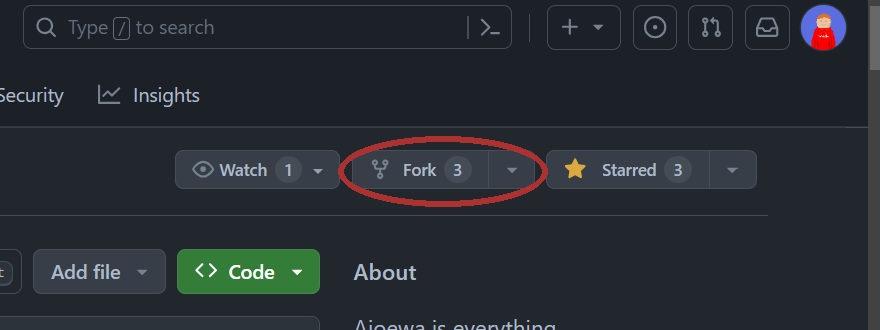
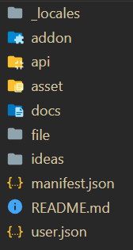
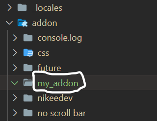
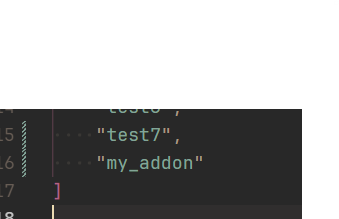
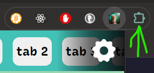
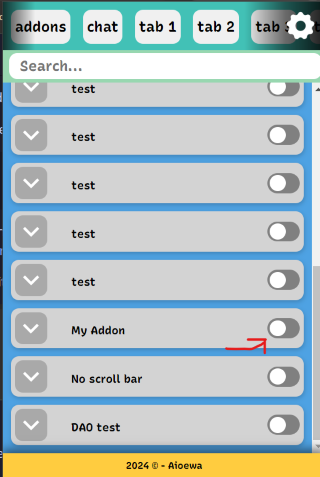
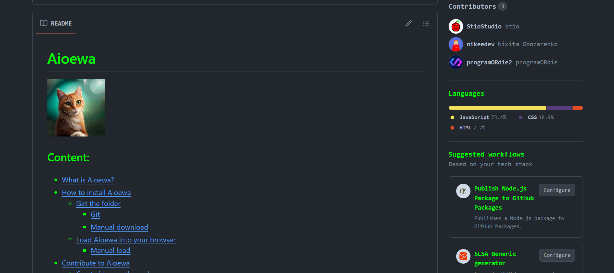

# Creating new fork and setting up a new addon


Start by going to the repository's website: [https://github.com/StioStudio/Aioewa](https://github.com/StioStudio/Aioewa), and click on "Fork" button: 
 Proceed by clicking on <span style="background-color:#347d39;color:#ffffff; padding: 0px 12px; border-width: 1px;border-radius: 6px;">Create Fork</span> down below. After it got created proceed to next step 

<br>

Open up a CMD on Windows or Terminal app on Mac, and run `cd` + appropriate location path where you want to have your fork saved on the computer. Run then git command with the URL of the repository, in my case it is "https://github.com/nikeedev/Aioewa" so we run that: `git clone https://github.com/nikeedev/Aioewa`. When it is done, you will have possibility to open the folder in your code editor. 

<br>

---

<br>

Now, let's see what folders we have in Aioewa repository. Open up the fork folder in a file explorer or a code editor.
<br>We have these folder:




We will take a look only at the important folders for now: 
- `_locales` folder = **[CURRENTLY NOT IN USE BY AIOEWA EXTENSION]** Contains folders of different language locales. You can add your language in here too, so that it shows for the translation for other users who use your language.
- `addon` folder = Contains folders which are the addons. When you want to create a new addon you first create a new folder in here.
- `api` folder = Contains the engines of the addons, it has different functions which parse JSON settings, run Javascript files and a lot more!

# Creating new addon

Let's start by creating a new folder inside `addons`, I will call it `my_addon`:



Now create a `info.json` file inside `my_addon`, let's add following code:

```json
{
    "AV": "1",
    "name": "My Addon",
    "description": "My Addon made by me :D",
    "tags": ["community"],
    "versionAdded": "1.0.0",
    "code": {
        "css": "style.css"
    }
}
```

- `AV` is Aioewa Version which basically specifies the version of the `info.json`, in future if values of info.json will be changed and it could possibly break the addon if it uses the old value Aioewa can check if you use up-to-date `info.json` specification.
- `name`: is the name of the addon, says itself.
- `description`: says itself too.
- `tags`: Tags which can be later used to filter addons by Tags to find addons for specific website or functionality.
- `versionAdded`: pretty much just says at what Aioewa version it was added.
Here come the fun part:
- `code`: This bit is important as it holds the values of the path of the source files of the addon. In this example we will do simple CSS. It could also be `IF_`, `js` and a few others that are covered in the ["info.json" File Reference](../info_json.md).

<br>

Before we proceed, open `addon.json` file which already exists in `addons` folder, and add `"my_addon"` or the name of you addon bellow in the array:



---

Now lets add Aioewa as an extension to the browser. Follow the instructions on Aioewa's repository README.md file: [Load Aioewa into your browser](https://github.com/StioStudio/Aioewa?tab=readme-ov-file#load-aioewa-into-your-browser).

After than click on the Aioewa Icon when it has loaded:



or click on the extension list button pointed with the green arrow.

Then scroll down till you find "My Addon" and click on the switch button:



---


Now, create a `style.css` file in same folder where `info.json` lies, and lets do some stuff with it.

Let's change the text color to green, and lets change the font too console font:

```css
body {
    color: #00ff00;
    font-family: monospace;
}
```

<br>

The result is interesting!



And it is just to change the CSS code and hitting reload website to get updated changes. 

On next page we will see how we can use `IF_` setting and Javascript to do something even more interesting. 

Next page: [Adding some code!](./adding_code.md)
